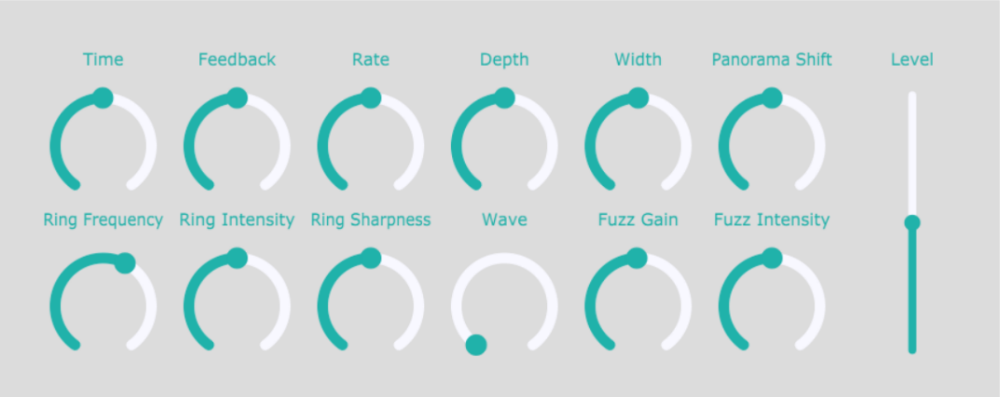

# StereoSanction MultiFX

VST3 multi-effect plug-in built with JUCE framework, with fractional delay line and circular buffer being the core of the application, which is then modulated in terms of delay time, RM and AM. Additionally, non-linear distortion module was implemented for StereoSanction to provide enrichment of the harmonic content of an input signal. 

   
    
   

